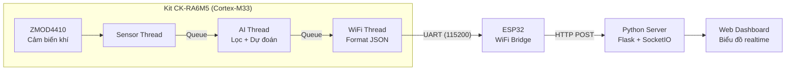
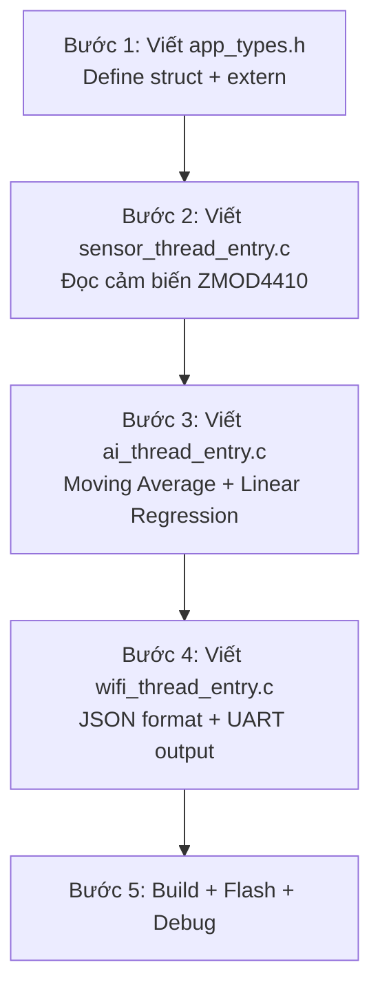
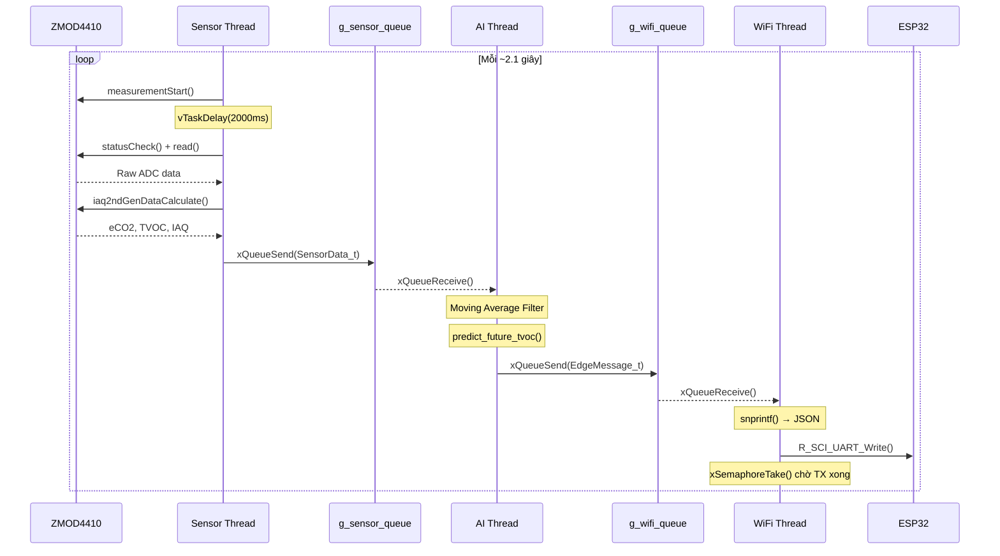

# Quy Trình Thực Hiện Đồ Án Edge AI

## Tổng quan hệ thống



---

## Giai đoạn 1 — Chuẩn bị phần cứng

### 1.1 Linh kiện cần có

| # | Linh kiện | Vai trò |
|---|---|---|
| 1 | **CK-RA6M5** (Renesas) | MCU chính, chạy FreeRTOS + AI inference |
| 2 | **ZMOD4410** (trên board hoặc breakout) | Cảm biến đo eCO2, TVOC, IAQ |
| 3 | **ESP32** (DevKit v1 hoặc tương đương) | WiFi bridge, nhận UART → gửi HTTP |
| 4 | Dây nối UART (TX/RX/GND) | Kết nối RA6M5 ↔ ESP32 |
| 5 | Cáp USB (Micro-B hoặc Type-C) | Nạp code + debug |

### 1.2 Sơ đồ kết nối phần cứng

```
CK-RA6M5                    ESP32
┌──────────┐                ┌──────────┐
│   SCI0   │                │          │
│   TX ────┼───────────────→│ RX (GPIO16)
│   RX ←───┼────────────────│ TX (GPIO17)
│   GND ───┼───────────────→│ GND      │
└──────────┘                └──────────┘
     │                           │
     │ I2C (SCI1)                │ WiFi
     │                           │
┌──────────┐                ┌──────────┐
│ ZMOD4410 │                │  Router  │
│ (0x32)   │                │  / PC    │
└──────────┘                └──────────┘
```

> [!IMPORTANT]
> - UART cross: TX của RA6M5 → RX của ESP32, và ngược lại
> - GND phải nối chung giữa 2 board
> - ZMOD4410 giao tiếp I2C qua SCI1 channel, địa chỉ slave `0x32`

---

## Giai đoạn 2 — Cài đặt môi trường phát triển

### 2.1 Phần mềm cần cài

| Phần mềm | Mục đích | Link |
|---|---|---|
| **e2 studio** (v2024.x+) | IDE lập trình RA6M5 | [renesas.com](https://www.renesas.com/e2studio) |
| **FSP** (Flexible Software Package) | Driver + RTOS config | Cài kèm e2 studio |
| **Arduino IDE** (2.x) | Lập trình ESP32 | [arduino.cc](https://www.arduino.cc/en/software) |
| **Python 3.10+** | Web Dashboard server | [python.org](https://www.python.org/) |
| **Google Colab** | Huấn luyện mô hình AI | [colab.google](https://colab.research.google.com/) |

### 2.2 Thư viện Python cần cài

```bash
pip install flask flask-socketio requests
```

---

## Giai đoạn 3 — Cấu hình FSP trên e2 studio

> [!NOTE]
> Đây là bước quan trọng nhất. Tất cả driver, thread, queue, semaphore được cấu hình bằng giao diện GUI của FSP, sau đó FSP tự generate code vào thư mục `ra_gen/`.

### 3.1 Tạo project mới

1. **File → New → Renesas C/C++ Project → Renesas RA**
2. Chọn board: **CK-RA6M5**
3. Chọn template: **FreeRTOS - Minimal**
4. Đặt tên project: `EdgeAI`

### 3.2 Cấu hình Threads (trong FSP Configuration)

Mở file `configuration.xml` → tab **Threads**:

| Thread | Priority | Stack Size | Vai trò |
|---|---|---|---|
| **Sensor Thread** | 3 (cao nhất) | 1024 bytes | Đọc ZMOD4410 |
| **AI Thread** | 2 | 4096 bytes | Lọc nhiễu + AI inference |
| **WiFi Thread** | 1 (thấp nhất) | 1024 bytes | Format JSON + gửi UART |

### 3.3 Cấu hình Objects (Queue + Semaphore)

Trong tab **Objects** của FSP:

| Object | Loại | Tham số |
|---|---|---|
| `g_sensor_queue` | Message Queue | Item size = 12B, Depth = 5 |
| `g_wifi_queue` | Message Queue | Item size = 16B, Depth = 5 |
| `g_zmod_semaphore` | Counting Semaphore | Max = 256, Initial = 0 |

> [!TIP]
> Item size phải khớp chính xác với `sizeof(SensorData_t)` = 12 bytes và `sizeof(EdgeMessage_t)` = 16 bytes

### 3.4 Cấu hình Stacks (Peripherals)

#### Sensor Thread → Thêm ZMOD4410 stack:
1. Click **Sensor Thread** → **New Stack → Sensor → ZMOD4410**
2. FSP tự thêm: I2C (SCI1), External IRQ, ZMOD4xxx driver
3. Chọn thuật toán: **IAQ 2nd Generation**
4. I2C slave address: `0x32`

#### WiFi Thread → Thêm UART stack:
1. Click **WiFi Thread** → **New Stack → Connectivity → UART (r_sci_uart)**
2. Channel: **0** (SCI0)
3. Baudrate: **115200**
4. Callback: `user_uart_callback`

### 3.5 Generate Code

1. Click **Generate Project Content** (nút ⚡ trên thanh công cụ)
2. FSP tạo các file trong `ra_gen/`:
   - `sensor_thread.c/.h` — Khởi tạo ZMOD4410 driver
   - `ai_thread.c/.h` — Khung thread AI
   - `wifi_thread.c/.h` — Khởi tạo UART driver
   - `common_data.c/.h` — Queue, Semaphore definitions
   - `main.c` — Hàm `main()`, tạo threads, start scheduler

---

## Giai đoạn 4 — Lập trình Firmware (RA6M5)

### 4.1 Cấu trúc file source

```
src/
├── app_types.h              ← Struct + extern + constants
├── sensor_thread_entry.c    ← Đọc ZMOD4410 → gửi Queue
├── ai_thread_entry.c        ← Lọc trung bình + AI predict
├── wifi_thread_entry.c      ← Format JSON → gửi UART
└── hal_warmstart.c          ← BSP init (auto-generated, ít sửa)
```

### 4.2 Thứ tự lập trình



#### Bước 1 — `app_types.h`
- Định nghĩa `SensorData_t` (eCO2, TVOC, IAQ)
- Định nghĩa `EdgeMessage_t` (data + predicted TVOC)
- Khai báo `extern` cho queue và semaphore
- Define các hằng số hệ thống

#### Bước 2 — `sensor_thread_entry.c`
- Mở I2C + khởi tạo ZMOD4410
- Vòng lặp: Start measurement → Delay 2s → Read → Calculate IAQ
- Gửi `SensorData_t` vào `g_sensor_queue`

#### Bước 3 — `ai_thread_entry.c`
- Nhận data từ `g_sensor_queue`
- Lọc nhiễu bằng Moving Average (window = 5)
- Chạy Linear Regression: `predicted_tvoc = w1*eCO2 + w2*TVOC + intercept`
- Đóng gói `EdgeMessage_t` → gửi vào `g_wifi_queue`

#### Bước 4 — `wifi_thread_entry.c`
- Mở UART (SCI0, 115200 baud)
- Nhận `EdgeMessage_t` từ `g_wifi_queue`
- Format thành JSON: `{"eco2":..., "tvoc":..., "iaq":..., "pred_tvoc":...}\n`
- Gửi qua UART sang ESP32

### 4.3 Luồng dữ liệu chi tiết



---

## Giai đoạn 5 — Huấn luyện mô hình AI (Google Colab)

### 5.1 Thu thập dữ liệu

1. Chạy firmware (chưa có AI, chỉ đọc sensor + gửi UART)
2. Log dữ liệu eCO2, TVOC qua Serial Monitor trong ~vài giờ
3. Lưu thành file CSV:
   ```
   eco2,tvoc,future_tvoc
   450.2, 120.5, 135.0
   460.1, 125.3, 140.2
   ...
   ```

### 5.2 Huấn luyện trên Colab

```python
from sklearn.linear_model import LinearRegression
import numpy as np

# Load data
data = pd.read_csv("sensor_data.csv")
X = data[['eco2', 'tvoc']].values    # Features
y = data['future_tvoc'].values        # Target (TVOC ở thời điểm t+1)

# Train
model = LinearRegression()
model.fit(X, y)

# Export weights cho MCU
print(f"w1 = {model.coef_[0]}f;")      # → 0.6667930273802654
print(f"w2 = {model.coef_[1]}f;")      # → -3.8307690556863823
print(f"intercept = {model.intercept_}f;")  # → -251.90307790369928
```

### 5.3 Đưa weights vào firmware

Copy kết quả vào `ai_thread_entry.c`:
```c
static const float ai_w1 = 0.6667930273802654f;
static const float ai_w2 = -3.8307690556863823f;
static const float ai_intercept = -251.90307790369928f;
```

---

## Giai đoạn 6 — Lập trình ESP32 (WiFi Bridge)

### 6.1 Chức năng

ESP32 đóng vai trò **cầu nối**: nhận JSON từ UART → gửi HTTP POST lên Python server.

### 6.2 Code Arduino (sketch)

```cpp
#include <WiFi.h>
#include <HTTPClient.h>

const char* ssid = "YOUR_WIFI_SSID";
const char* password = "YOUR_WIFI_PASSWORD";
const char* serverUrl = "http://192.168.1.xxx:5000/api/data";

void setup() {
    Serial.begin(115200);     // Debug
    Serial2.begin(115200);    // UART từ RA6M5 (GPIO16=RX, GPIO17=TX)
    
    WiFi.begin(ssid, password);
    while (WiFi.status() != WL_CONNECTED) {
        delay(500);
    }
}

void loop() {
    if (Serial2.available()) {
        String json = Serial2.readStringUntil('\n');  // Đọc 1 dòng JSON
        
        if (json.length() > 0 && WiFi.status() == WL_CONNECTED) {
            HTTPClient http;
            http.begin(serverUrl);
            http.addHeader("Content-Type", "application/json");
            
            int httpCode = http.POST(json);  // Gửi lên server
            http.end();
        }
    }
}
```

> [!TIP]
> ESP32 dùng `readStringUntil('\n')` nên firmware RA6M5 **bắt buộc** phải có `\n` ở cuối JSON.

---

## Giai đoạn 7 — Xây dựng Web Dashboard (Python)

### 7.1 Kiến trúc server

```
dashboard/
├── app.py              ← Flask server + SocketIO
├── templates/
│   └── index.html      ← Giao diện biểu đồ
└── static/
    ├── css/style.css
    └── js/chart.js     ← Chart.js realtime
```

### 7.2 Flask Server (`app.py`)

```python
from flask import Flask, render_template, request
from flask_socketio import SocketIO

app = Flask(__name__)
socketio = SocketIO(app, cors_allowed_origins="*")

@app.route('/')
def index():
    return render_template('index.html')

@app.route('/api/data', methods=['POST'])
def receive_data():
    data = request.get_json()
    # Broadcast realtime tới tất cả browser clients
    socketio.emit('new_data', data)
    return {'status': 'ok'}, 200

if __name__ == '__main__':
    socketio.run(app, host='0.0.0.0', port=5000)
```

### 7.3 Frontend (`index.html`)

- Dùng **Chart.js** hoặc **Plotly.js** vẽ biểu đồ realtime
- Kết nối **Socket.IO** client để nhận data push
- Hiển thị: eCO2, TVOC, IAQ, Predicted TVOC trên 4 biểu đồ

---

## Giai đoạn 8 — Tích hợp & Kiểm thử

### 8.1 Checklist kiểm thử

| # | Hạng mục | Cách test |
|---|---|---|
| 1 | ZMOD4410 đọc data | Xem giá trị eCO2/TVOC qua debug breakpoint |
| 2 | Queue Sensor→AI | Đặt breakpoint trong `ai_thread_entry`, kiểm tra `raw_data` |
| 3 | Moving Average | So sánh giá trị trước/sau filter (vài sample đầu) |
| 4 | AI prediction | Tính tay `w1*eCO2 + w2*TVOC + intercept`, so với output |
| 5 | JSON output | Dùng USB-TTL đọc UART output trên PC (PuTTY/Tera Term) |
| 6 | ESP32 WiFi POST | Xem Serial Monitor của ESP32, kiểm tra HTTP response |
| 7 | Dashboard realtime | Mở browser, xem biểu đồ cập nhật mỗi ~2 giây |

### 8.2 Debug tips

> [!WARNING]
> - Nếu ZMOD4410 trả về giá trị 0 hoặc lỗi: cần chờ **warm-up 10-15 phút** sau khi cấp nguồn
> - Nếu UART không nhận được data: kiểm tra **TX/RX đã cross** chưa, và **GND chung**
> - Nếu Dashboard không cập nhật: kiểm tra **IP address** trong code ESP32 có đúng IP máy chạy Python không

---

## Tổng kết thời gian ước tính

| Giai đoạn | Thời gian |
|---|---|
| 1. Chuẩn bị phần cứng | 1 ngày |
| 2. Cài đặt môi trường | 1 ngày |
| 3. Cấu hình FSP | 1-2 ngày |
| 4. Lập trình Firmware | 3-5 ngày |
| 5. Huấn luyện AI | 1-2 ngày |
| 6. Lập trình ESP32 | 1 ngày |
| 7. Web Dashboard | 2-3 ngày |
| 8. Tích hợp & Debug | 2-3 ngày |
| **Tổng** | **~2-3 tuần** |
